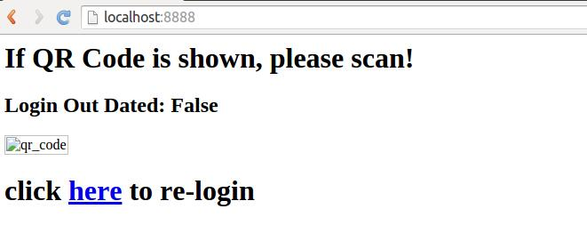

FAQ
--------------

## 我要怎么登陆一个新用户？

```bash
python run.py --new-user
```

## 我要怎么让它不自动弹出二维码, 或者使用在没有GUI的环境？

```bash
python run.py --no-gui
```

如果你想使用web界面来显示二维码的话，请执行

```bash
pip install bottle # 安装bottle依赖
python run.py --no-gui --http
```

然后，访问 `http://your_host_name_or_ip_addr:8888` 来查看当前的登录状态或者扫码登录。

#### 登录界面：


#### 登录未过期



## 我要怎么让程序进入DEBUG模式, 显示更详细的服务器响应内容呢?

```bash
python run.py --debug
```